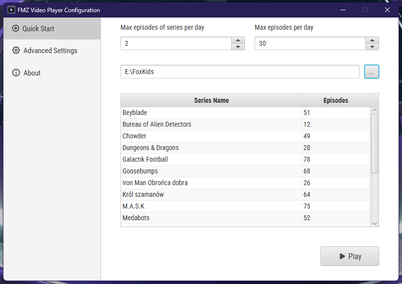
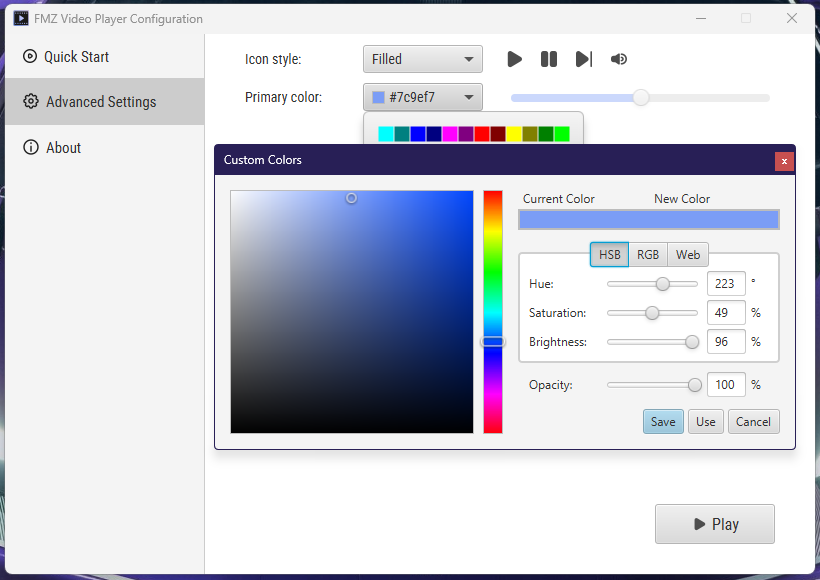

# FMZ Video player - your local TV

One day, I started missing the times when I could watch cartoons on FoxKids, Jetix, and Cartoon Network. That's when I decided to take the first step toward creating software that would help me relive those childhood memories. I hope that, just like me, you'll find FMZ Video Player useful too.

  

## Quick Start

Tab "Quick Start" is designed to help you quickly set up the player and start watching your favorite videos. 
Here, you can add a main video source, configure max episodes of series per day, max all episodes per day, and start watching TV.
Quick Start Tab also shows you the current series available in the main video source and the number of episodes available in the series.

  

## Advanced Settings

Tab "Advanced Settings" is designed to help you configure the player in detail. 
Here, you can choose the video icons theme and primary color for the player. 
In future versions, you will be able to configure the video player settings, such as audio normalization or advanced
video schedule settings. There will be set custom configuration for every day of the week, 
allowing you to set different video sources for each day, as well as the ability to add ads between episodes.

  

## Audio Normalization

There is built-in audio normalization feature that allows you to adjust the volume of all videos to a similar level.
In future versions, this feature will be available in the advanced settings tab. 
The below animation shows when the audio normalization works.

## Naming convention

The software is designed to use this structure:

    ├── MAIN_DIRECTORY
    │      ├── VIDEO_SERIES_1
    │      ├── VIDEO_SERIES_2
    │      ├── VIDEO_SERIES_3
    │      └── ...

    ├── FOXKIDS
    │      └── POWER RANGERS MIGHTY MORPHIN
    │                ├── S01E01-Episode-name
    │                ├── S01E02-Episode-name
    │                └── ...
    │      ├── X-MAN
    │      ├── SIMPSONS
    │      └── ...

Local videos must be named in this format:

       SXXEYY-Episode-name
       SEASON XX EPISODE YY-EPISODE-NAME

       For example:
       S01E01-The-Blade-Raider

  

## Running Version 1.0.0
1. Build a project using Maven `mvn clean install`.
2. After building the project, navigate to the target folder and move the **fmz-video-player-1.0.0-SNAPSHOT.jar** file, for instance, to the Desktop.
3. Open a terminal in the folder containing the .jar file and use the command `java -jar fmz-video-player-1.0.0-SNAPSHOT.jar` or double-click the .jar file to run it.

### Plans
- Clean up this mess in the code ( ͡° ʖ̯ ͡°)
- Adding an advanced schedule for videos (Mon, Tue, Wed, Thu, Fri, Sat, Sun)
- Ability to play ads between episodes
- Option to configure episode previews
- Ability to build custom schedules without using the automation tool
- Activation/Deactivation of audio normalization
- Removal of video speed configuration and replacement with dynamic settings access
- Control of the Player via a mobile app