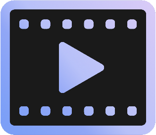

# FMZ Video player - v2.1.0

## Software prepared to generate private tv

This unique software allows you to generate a private TV station experience based on your local video sources.
FMZ Video player curates a complete schedule prepared from your local video collection and configuration preferences.
This fantastic piece of software was born from a sense of nostalgia, with features that let you relive the experience of classic TV channels such as FoxKids, Jetix, and CartoonNetwork.

  

## Configuration

Current version 2.1.0 has all configuration parameters in `com.filipmikolajzeglen.video.VideoPlayerConfiguration`.
In future this configuration will be moved to application.properties and then used for additional config view.

**PRIMARY_COLOR** is a String expressing the hex code for the color of time and volume sliders.

- `PRIMARY_COLOR = "#7C9EF7"`

**MAX_SINGLE_SERIES_PER_DAY** regulates the number of episodes from a single series that can be played back-to-back per day. By default, this is set to 2.

- `MAX_SINGLE_SERIES_PER_DAY = 2`

**MAX_EPISODES_PER_DAY** caps the total number of videos that can be played in a day.

- `MAX_EPISODES_PER_DAY = 30`

**VIDEO_MAIN_SOURCE** is a static variable directing FMZ Video Player to the primary directory with all videos.

- `VIDEO_MAIN_SOURCE = "E:\\FoxKids"`

**FMZ_DATABASE_NAME** names the integrated database supplied by FMZDatabase.

- `FMZ_DATABASE_NAME = "FMZDB"`

**FMZ_TABLE_NAME** provides the name for the table in the built-in database.

- `FMZ_TABLE_NAME = "FoxKids"`

**FMZ_DIRECTORY_PATH** specifies the location for the creation of the database.

- `FMZ_DIRECTORY_PATH = "E:\\"`

The software is designed to use this structure:
    
    ├── MAIN_DIRECTORY
    │      ├── VIDEO_SERIES_1
    │      ├── VIDEO_SERIES_2
    │      ├── VIDEO_SERIES_3
    │      └── ...

    ├── FOXKIDS
    │      └── POWER RANGERS MIGHTY MORPHIN
    │                ├── S01E01-Episode-name
    │                ├── S01E02-Episode-name
    │                └── ...
    │      ├── X-MAN
    │      ├── SIMPSONS
    │      └── ...

Local videos must be named in this format:

       SXXEYY-Episode-name
       SEASON XX EPISODE YY-EPISODE-NAME
       
       For example:
       S01E01-The-Blade-Raider

  

## Running Version 2.1.0
Until an interface is designed for easy software management, the only feasible option to use the player is by configuring FMZ Video Player and building the artifact yourself:

1. Open IDE and provide configuration in `com.filipmikolajzeglen.video.VideoPlayerConfiguration`.
2. Build project using Maven `mvn clean install`.
3. After building the project, navigate to the target folder and move the **fmz-video-player-2.1.0-SNAPSHOT.jar** file, for instance, to the Desktop.
4. Open a terminal in the folder containing the .jar file and use the command `java -jar fmz-video-player-2.1.0-SNAPSHOT.jar`.

## Future Plans
- Developing an additional config panel for simplified FMZ Video Player configuration.
- Integrating a Web Client for remote video playback.
- Offering FMZ Video Player in .exe format.

### Version 2.1.0
- Replaced external video players with an integrated, built-in player.
- Introduced FMZDatabase, a dedicated built-in database created to store episode information and their playback status.
- Added functionality to interpret which episode should be run next.
- Enhanced built-in Logger for reporting FMZ Video Player events.
- Overall project cleanup.

### Version 1.0.0
- Introduced a schedule based on local video sources.
- Introduced a simple logger.
